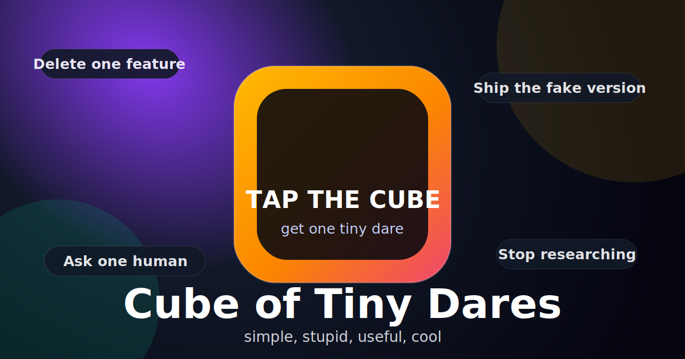

<div align="center">
  

  <h1>🎲 Cube of Tiny Dares</h1>

  <p><strong>Tap the cube. Get one tiny dare. Move.</strong></p>

  <p>
    <a href="https://github.com/jpatel98/cube-of-tiny-dares/actions/workflows/ci.yml"></a>
    <a href="LICENSE"></a>
    
    
    
  </p>
</div>

---

**Cube of Tiny Dares** is a tiny AI-appliance-shaped hackathon project for getting unstuck.

It is built for the Hugging Face Build Small Hackathon as a **Backyard AI** project: a small, specific tool for a real builder problem. When you are researching too long, adding one more feature, or randomly debugging instead of moving, the cube gives one concrete dare.

You tell it what loop you are in. You tap the cube. It gives **one tiny dare**:

- “Delete one feature.”
- “Ship the fake version first.”
- “Ask one human to try the ugly version today.”
- “Stop researching. Build the dumbest visible version.”

No dashboard. No productivity cosplay. No account system. Just a playful physical nudge toward motion.

## The vibe

Most builder tools ask you to manage more things.

This one asks you to do **one smaller thing**.

```text
context → tap → one tiny dare → move
```

## Demo examples

| Context | Tiny dare |
| --- | --- |
| “I keep researching models and can't pick a direction.” | “Stop researching. Build the dumbest visible version.” |
| “I want to add login before the demo.” | “Delete one feature. Keep the demo alive.” |
| “The deploy failed and I am randomly changing stuff.” | “Reproduce it once. Change one thing.” |
| “I finished a tiny fix but don't know what to do next.” | “Ask one person to try the ugly version.” |

## Features

- 🎲 **One-button Gradio app** — type context, tap the cube.
- 🧠 **Modal/Cohere-powered dare engine** — `CohereLabs/c4ai-command-r7b-12-2024` generates fresh dares on Modal when configured.
- 🧩 **Local reliability fallback** — the tiny local dare bank keeps the Space and ESP32 demo working if Modal is unavailable.
- 🔁 **Recent-dare avoidance** — avoids repeating the same dare immediately.
- 🌈 **Cube payload** — each dare includes display text, emoji, color, and timer seconds.
- 🔌 **ESP32 cube contract** — hardware calls one simple HTTP endpoint.
- ✅ **Backyard AI constraints respected** — small-model generation, deterministic fallback, one FastAPI endpoint, no account layer.

## Quick start

```bash
git clone https://github.com/jpatel98/cube-of-tiny-dares.git
cd cube-of-tiny-dares
python3 -m pip install -r requirements.txt
python3 app.py
```

Open:

- Web UI: <http://localhost:7860>
- Health: <http://localhost:7860/api/health>

Live Space:

- App: <https://build-small-hackathon-cube-of-tiny-dares.hf.space/>
- Space repo: <https://huggingface.co/spaces/build-small-hackathon/cube-of-tiny-dares>
- Public GitHub repo: <https://github.com/jpatel98/cube-of-tiny-dares>
- Demo video: TODO — add the 30-60 second demo link before submission.
- Social post: TODO — add the public social post link before submission.

## ESP32 cube

The ESP32 does **not** need to know anything about Gradio.

It can call the simple JSON endpoint:

```bash
curl -sS -X POST http://localhost:7860/api/dare \
  -H 'Content-Type: application/json' \
  -d '{"context":"I keep researching and cannot pick a direction"}'
```

Optional request fields (JSON):

- `mode`: `builder` (default), `hackathon`, `chaos goblin`, `gentle`
- `intensity`: `gentle`, `medium` (default), `spicy`
- `recent`: list of recent dare texts (used for dedupe)
- `seed`: integer for deterministic output when re-testing

Example response:

```json
{
  "dare": {
    "text": "Stop researching. Build the dumbest visible version.",
    "why": "More input will not pick the idea for you. A visible fake will.",
    "emoji": "🧪",
    "color": "#FFB703",
    "minutes": 20,
    "label": "research_loop"
  },
  "generation": {
    "provider": "modal",
    "model": "CohereLabs/c4ai-command-r7b-12-2024",
    "fallback": false
  },
  "cube": {
    "display": "Stop researching. Build the dumbest visible version.",
    "emoji": "🧪",
    "color": "#FFB703",
    "timer_seconds": 1200,
    "speak": "Stop researching for 20 minutes..."
  }
}
```

The cube response includes:

- `cube.display`
- `cube.color`
- `cube.timer_seconds`
- optional: `cube.emoji`, `cube.speak`

The top-level `generation` object is for the web app, README, and judges. It
shows whether the dare came from Modal + Cohere or from the local fallback. The
ESP32 contract does not depend on it.

For ESP32, only these are required:

- `cube.display`
- `cube.color`
- `cube.timer_seconds`

See [`hardware/esp32_tiny_dares`](hardware/esp32_tiny_dares/) for the minimal
protocol sketch.

The real Waveshare ESP32-S3 Touch LCD firmware path is now
[`hardware/waveshare_tiny_dares`](hardware/waveshare_tiny_dares/). It vendors
the AgentGotchi display/touch/sprite firmware base so the physical cube can keep
the existing pet visual, and it has been adapted to post to `/api/dare` on
screen tap or KEY press. The flashed UI intentionally stays simple: one title,
one pet sprite, the dare text, and the dare accent color. The API still includes
`cube.timer_seconds` for compatibility, but the current device screen does not
show a countdown. The firmware also sends recent successful dare texts so
back-to-back taps do not keep returning the same dare.

The default Waveshare firmware endpoint is the live hackathon Space API:

```text
https://build-small-hackathon-cube-of-tiny-dares.hf.space/api/dare
```

For the hackathon submission, the ESP32 path is part of the main demo, not a bonus. The web app should work alone, but the physical cube should be able to trigger the same `/api/dare` contract and show the dare text/color.

### Submission copy (Backyard AI)

- Small, physical AI appliance that nudges you from analysis loops into action.
- One control: context input + one tap = one dare.
- No dashboard. No planning tool. No accounts. No productivity bloat.
- Demonstrates a repeatable anti-overwhelm workflow for builders under real constraints.

## Hugging Face Spaces

This repo is ready for a Hugging Face Space.

The README contains the required Spaces metadata frontmatter. The Space uses a
small Docker wrapper so the Gradio UI and custom FastAPI hardware endpoints are
served by the same ASGI app.

The app entrypoint is:

```text
app.py
```

To deploy manually:

1. Create a new Hugging Face Space.
2. Select **Docker**.
3. Push this repo to the Space.
4. The container should boot `uvicorn app:app` from `Dockerfile`.

## Modal/Cohere-powered generator

The intended live submission path uses Modal as the primary generator and keeps
the local dare bank as a reliability fallback.

For the Modal Awards track, the intended load-bearing path is:

```text
Gradio app / ESP32 -> /api/dare -> Modal-hosted Cohere SLM -> validated cube payload
                                      -> local fallback if Modal is unavailable
```

The included Modal app is [`modal_dare_generator.py`](modal_dare_generator.py).
It targets `CohereLabs/c4ai-command-r7b-12-2024`, which is under the hackathon's
32B parameter limit. The model is gated on Hugging Face, so the deploying HF
account must have model access and Modal needs an `HF_TOKEN` secret.

Local app environment:

```bash
export DARE_GENERATOR=modal
export MODAL_DARE_URL="https://axion-technologies--dare.modal.run"
```

Optional endpoint bearer token:

```bash
export MODAL_DARE_TOKEN="..."
```

Modal setup sketch:

```bash
python3 -m pip install modal
modal setup
modal secret create huggingface-secret HF_TOKEN=...
modal deploy modal_dare_generator.py
```

The hackathon Space is configured with `DARE_GENERATOR=modal` and the deployed
Modal endpoint at `https://axion-technologies--dare.modal.run`. If Modal is
slow, unavailable, returns invalid JSON, or repeats a recent dare, the app falls
back to the local generator so the web app and ESP32 demo still work.

Live verification:

```json
{
  "generation": {
    "provider": "modal",
    "model": "CohereLabs/c4ai-command-r7b-12-2024",
    "fallback": false
  }
}
```

## Hackathon readiness

Current target: a Backyard AI submission that demonstrates a tiny physical AI appliance for builder momentum.

Live Hugging Face Space:

```text
https://huggingface.co/spaces/build-small-hackathon/cube-of-tiny-dares
```

Before submitting:

- Deploy the app to a Hugging Face Space.
- Verify `GET /api/health` and `POST /api/dare` on the Space. Current hosted `/api/dare` verification returns `generation.provider: "modal"`.
- Verify the Waveshare firmware can fetch a dare from the live Space endpoint.
- Record a short demo showing web context input, cube tap, and ESP32 display/status output.
- Explain the small-model/small-system constraint: the primary live path uses a small Cohere model on Modal under the hackathon limit, and the local fallback keeps the cube reliable.

### Sponsor track notes

**OpenAI Codex Track:** this project is being built with OpenAI Codex as the coding agent. The public GitHub repo is:

```text
https://github.com/jpatel98/cube-of-tiny-dares
```

To stay eligible, the public repo should include at least one Codex-attributed commit before submission, and this repo link should remain visible in the Space README.

**Modal Awards:** this repo includes a deployed Modal/Cohere dare generator, and the Hugging Face Space is configured to call it from `/api/dare`. Live verification returns `generation.provider: "modal"` and `generation.fallback: false`.

**Tiny Titan:** not targeted for the current submission because the Cohere 7B model is above the Tiny Titan 4B limit.

## Development

Run tests:

```bash
python3 -m pytest tests/ -q
```

Compile-check Python files:

```bash
python3 -m py_compile app.py tiny_dares/core.py
```

## Project structure

```text
app.py                         # FastAPI + Gradio app
tiny_dares/core.py             # tiny dare generator
tiny_dares/modal_client.py     # Modal endpoint client + validation
modal_dare_generator.py        # Modal-hosted Cohere SLM endpoint
tests/                         # pytest tests
hardware/esp32_tiny_dares/     # minimal ESP32 protocol sketch
hardware/waveshare_tiny_dares/ # real Waveshare ESP32-S3 firmware base
assets/social-card.svg         # repo/social preview art
plan.md                        # build plan / scope guard
```

## Scope guard

Please do **not** turn this into:

- a habit tracker
- a task manager
- a Notion integration
- a dashboard
- a full chatbot
- a wellness app

The magic is that it is almost nothing.

## 30-second demo script

1. Open the web UI and type one short context line.
2. Tap **TAP THE CUBE, GET ONE DARE, MOVE ⚡**.
3. Tap the ESP32 cube.
4. Show the cube reading `cube.display` and `cube.color` from `/api/dare`.

## Contributing

Tiny dares, hardware improvements, and vibe-preserving UX fixes are welcome.

Read [`CONTRIBUTING.md`](CONTRIBUTING.md) first.

## License

MIT — see [`LICENSE`](LICENSE).
